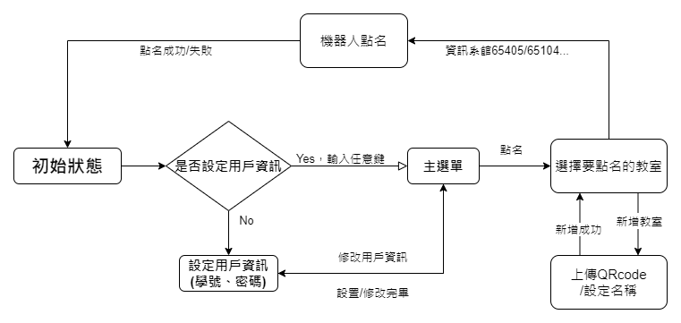

# LineChatBot
成大資工計算理論課程Project

## Description

透過此聊天機器人進行防疫QRcode點名，但是目前只能**沒有症狀**的防疫點名，**若是出現疫情相關症狀，還是建議手動登記！**

## 使用說明

* 當用戶為第一次使用時，需要新增用戶資訊來做後續的動作(成功入口帳號密碼)
* 建立用戶資訊後，可以透過主選單選擇**點名**或**修改帳號密碼**
* 選擇點名
    * 可以直接選擇既有的教室來作為防疫登入
    * 或自行上傳教室名稱與QRcode

## QR code

可以利用下列的QRcode加入好友

## 參考資料

* [官方文件](https://devcenter.heroku.com/articles/getting-started-with-python)
* [Deploy flask to heroku](https://github.com/twtrubiks/Deploying-Flask-To-Heroku)
* [line-bot-tutorial](https://github.com/twtrubiks/line-bot-tutorial)
